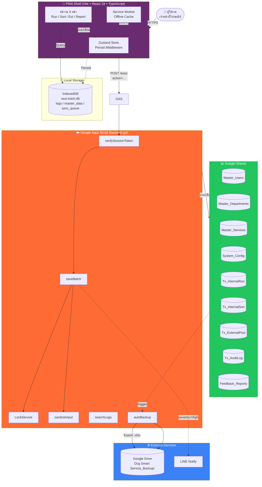

# 🏛️ รายงานวิเคราะห์สถาปัตยกรรมและโครงสร้างระบบ DCG Smart Service

> **ชื่อระบบ**: DCG Smart Service — ระบบบันทึกการให้บริการงานไปรษณีย์ภัณฑ์ ส่วนอำนวยการสารบรรณ
> **เวอร์ชันเอกสาร**: 2.1
> **อัปเดตล่าสุด**: 2026-06-04 (17:00 ICT)

เอกสารนี้แสดงการตรวจสอบโครงสร้างซอร์สโค้ดปัจจุบันของระบบ **DCG Smart Service** (ทั้งฝั่ง Frontend React/TypeScript และ Backend Google Apps Script) พร้อมคำแนะนำเชิงสถาปัตยกรรมในการเสริมโมดูลที่สำคัญเพื่อให้ระบบมีความสมบูรณ์ ปลอดภัย และตรงตามมาตรฐาน PWA และ Google Sheets Backend 100%

---

## 🔍 1. การวิเคราะห์โครงสร้างระบบในปัจจุบัน

### 💻 1.1 สถาปัตยกรรมภาพรวม (Architecture Diagram)



**คำอธิบายชั้นสถาปัตยกรรม**:

| ชั้น | เทคโนโลยี | หน้าที่ |
| :--- | :--- | :--- |
| **Presentation** | React 19 + Tailwind 3 + Framer Motion | UI 4 หน้า (Run / Sort / Ext / Report) + Public Tracking |
| **State** | Zustand + Persist | Global state + cache ใน LocalStorage |
| **Service** | TypeScript modules | `api.ts` (HTTP), `syncEngine.ts` (queue), `db.ts` (IndexedDB) |
| **Data Local** | IndexedDB (idb v8) | เก็บ logs, master_data, sync_queue แบบ offline-first |
| **Data Remote** | Google Apps Script + Sheets | Backend serverless + database |
| **External** | Google Drive, LINE Notify | Auto backup + alerting |

---

### 💻 1.2 ฝั่ง Frontend (React, TypeScript & Zustand)

* **การจัดการสถานะ (State Management)**: ใช้ Zustand Store [useAppStore.ts](../src/store/useAppStore.ts) ในการจัดการ Global State แบบ Persistent (เก็บบางส่วนลง LocalStorage) ซึ่งลดโหลดการเก็บข้อมูลในเครื่องและป้องกันปัญหาข้อมูลผู้ใช้งานอื่นๆ รั่วไหลเมื่อล็อกเอาต์
* **การทำงานออฟไลน์ (Offline Database)**: ใช้ IndexedDB ผ่านโมดูล [db.ts](../src/lib/db.ts) ในการเก็บบันทึกข้อมูลธุรกรรมที่ค้างรอการซิงค์ (`non-synced logs`) ซึ่งแยกโครงสร้างได้ดีเยี่ยมตามหลักสถาปัตยกรรม PWA
* **สัญญาเชื่อมต่อ API**: ไฟล์ [api.ts](../src/services/api.ts) มีตัวดักเช็คการเชื่อมต่อเครือข่ายด้วยฟังก์ชัน `checkConnection()` เพื่อส่งสัญญาณออฟไลน์/ออนไลน์ให้กับหน้ากาก Layout
* **กลไกการซิงค์ (Sync Engine)**: ไฟล์ [syncEngine.ts](../src/services/syncEngine.ts) ใช้แนวคิด Optimistic UI — เขียนลง IndexedDB ก่อน แล้ว trigger background sync ไป Apps Script
* **การยืนยันตัวตน (Authentication)**: ไฟล์ [LoginView.tsx](../src/components/auth/LoginView.tsx) รองรับ 3 ช่องทาง ได้แก่ OTP ผ่านอีเมล, Google Identity Services (OIDC), และ Mock Login (เฉพาะ localhost)

### ☁️ 1.3 ฝั่ง Backend (Google Apps Script - `backend.gs`)

* **โครงสร้างการจองคิวข้อมูล (Race Condition Prevention)**: ใช้ `LockService` ล็อกการเขียนข้อมูลลง Google Sheets เพื่อป้องกันการเขียนชนกันขณะที่มีคำขอซิงค์เข้ามาพร้อมกันจากพนักงานหลายคน
* **การรักษาความปลอดภัย (Security)**:
  * ระบบมีการดักจับและล้าง Formula Injection (`sanitizeInput`) — **อัปเดต v2.1**: ปรับปรุงให้ trim whitespace/newlines/BOM ก่อนตรวจ prefix ตาม OWASP CSV Injection guidelines เพิ่มการตรวจ `\t` และ `\r` ด้วย
  * มีการตรวจสอบความถูกต้องของเซสชันล็อกอินผ่านอีเมลเครือข่าย `@wu.ac.th` และ OTP
  * รองรับการจำกัดวันทำการ (จันทร์-ศุกร์) เพื่อควบคุมการเข้าถึงในช่วงวันหยุด
* **ระบบแจ้งปัญหา (User Feedback)**: ✅ เพิ่มฟังก์ชัน `handleFeedback()` รองรับการรับข้อเสนอแนะจากผู้ใช้ บันทึกลงชีท `Feedback_Reports` พร้อม LockService ป้องกัน race condition และ LINE Notify สำหรับ severity High/Critical
* **ระบบสำรองข้อมูล (Auto Backup)**: ✅ เพิ่ม `runAutoBackup()`, `applyBackupRetention()`, `setupDailyBackupTrigger()` — Export 3 ชีทธุรกรรมเป็น .xlsx ลง Google Drive ทุกวัน 02:00 น. พร้อม retention policy 30 วัน
* **การแจ้งเตือน (LINE Notify)**: ✅ เพิ่ม `sendLineNotification()` ส่งข้อความแจ้งเตือนผ่าน LINE Notify API เมื่อเกิดเหตุการณ์สำคัญ
* **การจัดการข้อมูลหลัก (Master Data)**: มี fallback data ในตัวสำหรับกรณีที่ Google Sheets ไม่พร้อมใช้งาน ทำให้ระบบไม่ล่มทันที
* **จำนวนบรรทัด**: **1,018 บรรทัด** (+266 จากเวอร์ชันก่อน) ครอบคลุม 10 actions (getMetaData, searchLogs, saveBatch, deleteLog, publicSearch, requestOTP, verifyOTP, **handleFeedback**, **runAutoBackup**, **setupDailyBackupTrigger**)

---

## ⚠️ 2. ปัญหาคุณภาพโค้ดที่พบ (Code Quality Issues)

> ปัญหาเหล่านี้ตรวจพบจากการตรวจสอบ source code ปัจจุบัน (มิถุนายน 2026) — ควรแก้ไขก่อน Migrate ขึ้น Production
> 
> **สถานะอัปเดต (4 มิ.ย. 2569)**: Formula Injection Bypass ใน `sanitizeInput()` ได้แก้ไขเรียบร้อยแล้ว; WCAG Contrast Ratio ใน `FeedbackButton.tsx` แก้ไขแล้ว

### 2.1 การใช้ `any` type มากเกินไป (47 จุด)

**ผลกระทบ**: ลดประโยชน์ของ TypeScript ในการตรวจจับข้อผิดพลาดตอน compile, ทำให้ refactor ยาก

**ไฟล์ที่พบมากที่สุด**:
| ไฟล์ | จำนวน `any` | ตัวอย่าง |
| :--- | :---: | :--- |
| `src/pages/ReportPage.tsx` | 13 | `json.data.run.forEach((r: any) => ...)` |
| `src/components/auth/PublicTrackView.tsx` | 11 | `const filterByDateRange = (items: any[]) => ...` |
| `src/lib/db.ts` | 8 | `data: any`, `payload: any` |
| `src/services/api.ts` | 2 | `filters: any`, `payload: any` |
| `src/services/syncEngine.ts` | 2 | `items: any[]`, `common: any` |
| `src/store/useAppStore.ts` | 1 | `setFilters: (filters: any) => void` |
| `src/components/common/ReceiptModal.tsx` | 2 | `data: any`, `item: any` |
| `src/components/layout/MainLayout.tsx` | 5 | `const list: any[] = []` |
| `src/pages/ExternalPage.tsx` | 3 | `extCart: any[]` |
| อื่นๆ | 2 | `LoginView.tsx`, `constants.ts` |

**แนวทางแก้ไข**: สร้าง TypeScript interfaces ครอบคลุม response ของแต่ละ API แล้วทยอยแทนที่ `any` เป็น type ที่ชัดเจน

---

### 2.2 การใช้ `alert()` และ `confirm()` แทน UI Components (7 จุด)

**ผลกระทบ**: UX ไม่สอดคล้องกับ design system (glassmorphism), บล็อกการทำงาน, ไม่รองรับ screen reader อย่างเต็มที่

**ไฟล์ที่พบ**:
| ไฟล์ | บรรทัด | การใช้งาน |
| :--- | :---: | :--- |
| `src/pages/RunPage.tsx` | 47 | `alert('กรุณาเลือกอย่างน้อย 1 รายการ')` |
| `src/pages/SortPage.tsx` | 39 | `alert('กรุณากรอกข้อมูลหน่วยงานและจำนวนไปรษณีย์ภัณฑ์')` |
| `src/pages/ExternalPage.tsx` | 31 | `alert('กรุณากรอกข้อมูลให้ครบถ้วน')` |
| `src/components/auth/PublicTrackView.tsx` | 161 | `alert('เกิดข้อผิดพลาด: ' + ...)` |
| `src/components/auth/PublicTrackView.tsx` | 165 | `alert('เกิดข้อผิดพลาดในการเชื่อมต่อ: ' + ...)` |
| `src/components/auth/PublicTrackView.tsx` | 172 | `alert('กรุณาเลือกหน่วยงานของท่าน')` |
| `src/pages/ReportPage.tsx` | 227 | `confirm('ยืนยันการลบรายการนี้?')` |

**แนวทางแก้ไข**: แทนที่ด้วย Toast component (มีอยู่ใน design system แล้ว) หรือสร้าง Modal/Dialog component ใหม่ที่รองรับ WCAG 2.2 AA

---

### 2.3 Tailwind Class ที่ไม่ถูกต้อง (2 จุด)

**ผลกระทบ**: Style render เพี้ยนหลัง build, Tailwind ไม่มี shade `650` ใน default palette

**ไฟล์ที่พบ**:
| ไฟล์ | บรรทัด | Class ผิด | ที่ถูกต้อง |
| :--- | :---: | :--- | :--- |
| `src/App.tsx` | 252 | `bg-purple-650` | `bg-purple-600` |
| `src/components/auth/PublicTrackView.tsx` | 288 | `bg-purple-650` | `bg-purple-600` |

**แนวทางแก้ไข**: แก้เป็น `bg-purple-600` และเพิ่ม ESLint rule block shade ที่ไม่อยู่ใน default Tailwind palette (เช่น `*-550`, `*-650`, `*-750`)

---

### 2.4 Test Coverage ต่ำมาก

**สถานะปัจจุบัน (อัปเดต 4 มิ.ย. 2569)**:
* มี Vitest + React Testing Library + fake-indexeddb ติดตั้งพร้อมใช้งาน
* มี Playwright script สำหรับ E2E (ดู `docs/playwright_test_report_th.md`)
* **มีไฟล์ test 3 ไฟล์** (เพิ่มขึ้นจาก 1 ไฟล์):
  * `src/utils/helpers.test.ts` (3 cases)
  * `src/components/common/FeedbackButton.test.tsx` (✅ ใหม่ — ทดสอบ render, validation, submission)
  * `src/services/backend.test.ts` (✅ ใหม่ — ทดสอบ backend logic)
* **ยังไม่มี test ครอบคลุม**: `syncEngine.ts`, IndexedDB operations, error handling

**ผลกระทบ**: ไม่มี regression safety net เพียงพอ, เสี่ยงต่อการเกิด bug ซ้ำหลัง refactor

**แนวทางแก้ไข**: เขียน test เพิ่มใน Q1 พร้อมกับ module 1.1 และ 1.2 (target coverage ≥ 60% สำหรับ critical paths)

---

### 2.5 npm Scripts มี Version Mismatch

**ปัญหา**: เมื่อรัน `npm run lint` หรือ `npm run test` ระบบแจ้งว่าไม่พบ script — เนื่องจาก ESLint ที่ติดตั้งใน `node_modules/.bin/` เป็นเวอร์ชัน 10.4.1 แต่ `package.json` ระบุ `^9.39.1`

**ผลกระทบ**: ไม่สามารถรัน lint/test ได้ → block การตรวจสอบคุณภาพโค้ด

**แนวทางแก้ไข**: รัน `npm install eslint@^9.39.1 --save-dev` เพื่อให้เวอร์ชันตรงกับที่ระบุไว้

---

## 📦 3. แผนการสำรองข้อมูลอัตโนมัติ (Auto Backup Plan)

> ✅ **ดำเนินการเสร็จสิ้นแล้ว** — 4 มิถุนายน 2569 | ผ่าน Forensic Audit (CLEAN verdict)

### 3.1 กลยุทธ์

* **Trigger**: Apps Script Time-driven trigger ทำงานทุกวันเวลา 02:00 น. (Asia/Bangkok)
* **วิธีการ**: Export Google Sheets ที่เป็น transaction data เป็นไฟล์ `.xlsx` แล้วบันทึกใน Google Drive folder แยกชื่อ `Dcg Smart Service_Backup/`
* **ชื่อไฟล์**: `Dcg_Smart_Service_Backup_<YYYY-MM-DD_HHmmss>.xlsx` (รวม timestamp ป้องกันการทับซ้อน)
* **Scope**: เฉพาะ 3 sheets ธุรกรรม ได้แก่ `Tx_InternalRun`, `Tx_InternalSort`, `Tx_ExternalPost` (master data เปลี่ยนน้อย ไม่จำเป็นต้อง backup ทุกวัน)
* **โค้ดจริง**: ดูใน [`backend.gs` บรรทัด 867-1018](../backend.gs)

### 3.2 โค้ดตัวอย่าง (Apps Script)

```javascript
const BACKUP_FOLDER_ID = PropertiesService.getScriptProperties()
  .getProperty("BACKUP_FOLDER_ID");

function autoBackup() {
  const ss = SpreadsheetApp.getActiveSpreadsheet();
  const sheetsToBackup = [
    'Tx_InternalRun',
    'Tx_InternalSort',
    'Tx_ExternalPost'
  ];
  const folder = DriveApp.getFolderById(BACKUP_FOLDER_ID);
  const timestamp = Utilities.formatDate(
    new Date(),
    'Asia/Bangkok',
    'yyyy-MM-dd_HH-mm'
  );

  sheetsToBackup.forEach(sheetName => {
    const sheet = ss.getSheetByName(sheetName);
    if (!sheet || sheet.getLastRow() <= 1) return;

    const blob = sheet.getAs(
      'application/vnd.openxmlformats-officedocument.spreadsheetml.sheet'
    );
    folder.createFile(blob)
      .setName(`${sheetName}_${timestamp}.xlsx`);
  });

  // ลบไฟล์ backup เก่าเกิน 30 วัน
  purgeOldBackups(folder, 30);

  Logger.log(`Backup completed at ${timestamp}`);
}

function purgeOldBackups(folder, retentionDays) {
  const cutoff = new Date();
  cutoff.setDate(cutoff.getDate() - retentionDays);

  const files = folder.getFilesByType(
    MimeType.MICROSOFT_EXCEL
  );
  while (files.hasNext()) {
    const file = files.next();
    if (file.getDateCreated() < cutoff) {
      file.setTrashed(true);
    }
  }
}

// ตั้ง Trigger ครั้งแรก: Run ฟังก์ชันนี้ 1 ครั้ง
function setupBackupTrigger() {
  ScriptApp.newTrigger('autoBackup')
    .timeBased()
    .atHour(2)
    .everyDays(1)
    .create();
}
```

### 3.3 Retention Policy

| ประเภท | ระยะเวลาเก็บ | หมายเหตุ |
| :--- | :---: | :--- |
| **Daily backups** | 30 วัน | ลบอัตโนมัติด้วย `purgeOldBackups()` |
| **Weekly archives** (เพิ่มในอนาคต) | 12 สัปดาห์ | เก็บทุกวันอาทิตย์ (optional) |
| **Monthly archives** (เพิ่มในอนาคต) | 12 เดือน | เก็บวันที่ 1 ของเดือน (optional) |

### 3.4 ขั้นตอนการกู้คืน (Restore Procedure)

1. เปิด Google Drive → เข้า folder `Dcg Smart Service_Backup/`
2. Download ไฟล์ `.xlsx` ที่ต้องการ
3. เปรียบเทียบข้อมูลกับ sheet ปัจจุบัน (ใช้ `=COUNTIF` หรือ filter)
4. คัดลอกแถวที่หายไปวางใน sheet ปัจจุบัน (ตรวจสอบ TxID ไม่ให้ซ้ำ)
5. ตรวจสอบความถูกต้องของข้อมูล
6. แจ้งผู้เกี่ยวข้องใน LINE กลุ่ม

### 3.5 ข้อควรระวัง

* ⚠️ **Google Drive Folder ID** ต้องเก็บใน Script Properties (อย่า hardcode)
* ⚠️ **Apps Script email quota** จำกัด 100 ฉบับ/วัน หาก backup fail ให้ log แทนการส่ง email
* ⚠️ **ทดสอบ restore** ใน dev environment ก่อนใช้งานจริง
* ⚠️ **สิทธิ์ folder**: ต้องให้ Apps Script มีสิทธิ์เขียน folder นั้น
* ⚠️ **Quota Apps Script runtime**: 6 นาที/ครั้ง — ถ้า sheet ใหญ่มากอาจ timeout

---

## 🛠️ 4. โมดูลและคอมโพเนนต์ที่แนะนำให้พัฒนาเพิ่มเติม

> โมดูลทั้งหมด 10 ตัว แบ่งเป็น Q0 (Foundation) – Q4+ (Optimization) รวมระยะเวลาประมาณ 6.5 สัปดาห์
> **Roadmap นี้ใช้แนวคิด Quarterly Sprints** — แต่ละ Q มี own scope, own tests, own docs เพื่อรับ feedback จากผู้ใช้จริงก่อนลงทุนใน Q ถัดไป

---

### 🟣 4.0 Q0: User Feedback Channel (Foundation) — ✅ เสร็จสมบูรณ์

* **Priority**: 🔴 สูง (Foundation — ต้องทำก่อน Q1)
* **Effort**: S–M (2–3 วัน)
* **สถานะ**: ✅ **ดำเนินการเสร็จสิ้น** — 4 มิถุนายน 2569 | ผ่าน Forensic Audit (CLEAN verdict)
* **ที่มา**: เพิ่มใหม่ตามที่ผู้พัฒนาเสนอ เพราะ Q-based approach ต้องพึ่ง user feedback

**✅ สิ่งที่พัฒนาสำเร็จแล้ว**:
* ปุ่ม Floating Button (มุมขวาล่าง) + Modal Form พร้อม Focus Trap (WCAG 2.2 AA)
* ประเภทปัญหา: Bug / Suggestion / Other | ระดับความรุนแรง: Low / Medium / High / Critical
* บันทึกลง `Feedback_Reports` sheet อัตโนมัติ พร้อม `sanitizeInput()` ป้องกัน Formula Injection
* LINE Notify แจ้งเตือนเมื่อ severity = High/Critical
* Unit tests ผ่าน (`FeedbackButton.test.tsx`)
* ไฟล์: [`FeedbackButton.tsx`](../src/components/common/FeedbackButton.tsx) + [`backend.gs:763-830`](../backend.gs)

**~~ปัญหาทางสถาปัตยกรรม~~ (แก้ไขแล้ว)**:
* ~~ปัจจุบันไม่มีช่องทาง structured สำหรับ user แจ้งปัญหา/ข้อเสนอแนะ~~
* ~~การแจ้งปัญหาทำได้แค่โทรหา admin หรือ LINE ส่วนตัว → ขาด audit trail~~
* ~~Q-based roadmap ต้องอาศัย feedback จริงจากผู้ใช้ แต่ไม่มีกลไกรับ~~

**แนวทางการพัฒนา**:
* ปุ่ม `แจ้งปัญหา/ข้อเสนอแนะ` แบบ Floating button ที่มุมขวาล่าง (Mobile-friendly)
* Modal form ประกอบด้วย:
  * **Type**: 🐛 Bug / 💡 Suggestion / ❓ Question
  * **Severity**: 🟢 Low / 🟡 Medium / 🔴 High / 🚨 Critical
  * **Description** (textarea, required)
  * **Page Context** (auto-capture: `activeTab`, URL, build version)
  * **Screenshot** (optional, paste from clipboard)
* Submit → save ไปยัง sheet ใหม่ `Feedback_Reports`
* ถ้า severity = High/Critical → trigger LINE Notify ไป admin
* Admin tab ใน ReportPage → ดู feedback ทั้งหมด + filter + mark as resolved

**โครงสร้าง Sheet: `Feedback_Reports`**:

| Column | Type | Note |
| :--- | :--- | :--- |
| `Timestamp` | DateTime | บันทึกอัตโนมัติ |
| `UserEmail` | string | ดึงจาก session |
| `Type` | string | Bug / Suggestion / Question |
| `Severity` | string | Low / Medium / High / Critical |
| `Description` | string | ข้อความจาก user |
| `PageContext` | string | JSON (tab, route, version) |
| `Screenshot` | string | base64 หรือ Drive URL (optional) |
| `Status` | string | New / InReview / Resolved / Dismissed |
| `AdminNote` | string | บันทึกจาก admin |

**Dependencies**:
* ใช้ร่วมกับ Module 3.1 (LINE Notify) — ไม่ต้องเขียนใหม่
* ใช้ Schema Guard (Q2) เพื่อสร้าง sheet อัตโนมัติ

**Risks**:
* ⚠️ **Low usage**: user ไม่ค่อยกด → ต้อง onboard + แจ้งใน announcement banner
* ⚠️ **Spam**: ต้องมี rate limit (1 feedback/นาที/user)
* ⚠️ **Sensitive data**: user อาจแนบข้อมูลส่วนตัว → ต้องมี privacy notice

**Acceptance Criteria**:
* User กดปุ่ม → form เปิดใน < 1 วินาที
* Submit สำเร็จ → แถวปรากฏในชีตภายใน 2 วินาที
* Severity = High/Critical → admin ได้รับ LINE ภายใน 1 นาที
* Admin เห็น feedback tab ใน ReportPage (เฉพาะ Role: Admin)
* Filter ได้ตาม Status, Severity, Type

---

### 🔴 4.1 Q1: Core Risk (3 โมดูล)

#### 4.1.1 Budget & Cost Statistics Dashboard

* **Priority**: 🔴 สูงมาก
* **ที่มา**: ผู้พัฒนาเสนอ (ปรับปรุงตามเงื่อนไขไม่มีงบประมาณจำกัดล่วงหน้า)

**ปัญหาทางสถาปัตยกรรม**:
* ระบบมีสูตรคำนวณและข้อมูลค่าใช้จ่ายธุรกรรม แต่ยังไม่มีส่วนกลางที่รวบรวมค่าใช้จ่ายและงบประมาณสะสมของแต่ละหน่วยงานแสดงให้พนักงานเห็นอย่างชัดเจนในหน้า Dashboard

**แนวทางการพัฒนา**:
* ใช้ตารางธุรกรรมเดิมที่มีข้อมูลค่าใช้จ่าย (`Cost` และยอดการใช้บริการ)
* Frontend: ออกแบบ UI ส่วนแสดงสถิติค่าใช้จ่ายไปรษณีย์สะสมจำแนกตาม แผนก แหล่งทุน หรือช่วงเวลา (เช่น ประจำเดือน/ประจำปี) เพื่อให้เจ้าหน้าที่และผู้บริหารมองเห็นภาพรวมการใช้งบได้อย่างรวดเร็ว

**Acceptance**: พนักงานสามารถมองเห็นและวิเคราะห์ยอดใช้จ่ายสะสมประจำเดือนของแต่ละแผนกได้ผ่านหน้าแดชบอร์ดรายงานผล โดยไม่มีการบล็อกการบันทึกข้อมูล


---

#### 4.1.2 Data Export (SheetJS)

* **Priority**: 🔴 สูง
* **ที่มา**: ผู้พัฒนาเสนอ

**ปัญหาทางสถาปัตยกรรม**:
* ไม่มีฟีเจอร์ export ข้อมูลเป็น Excel
* Handover doc ต้องส่งออกข้อมูลรายเดือนให้ admin → ทำด้วยมือ

**แนวทางการพัฒนา**:
* ติดตั้ง `xlsx` (SheetJS, ~700KB) หรือ `exceljs` (richer styling)
* ปุ่ม Export ใน ReportPage (3 tabs: Run/Sort/Ext) พร้อม filter
* Format: Thai headers, frozen first row, number format 2 decimals
* ชื่อไฟล์: `WUS_Track_<Type>_<YYYY-MM-DD>.xlsx`

**Acceptance**: Export 3 ประเภทได้, format ถูกต้อง, เปิดใน Excel ได้

---

#### 4.1.3 Cache Invalidation Layer

* **Priority**: 🔴 สูง
* **ที่มา**: รายงานฉบับก่อน (Module 4 เดิม)

**ปัญหาทางสถาปัตยกรรม**:
* Master data (departments, services) cache ใน IndexedDB ไม่ update เมื่อ admin แก้ในชีต
* User เห็นข้อมูลเก่าจนกว่าจะ clear cache ด้วยมือ

**แนวทางการพัฒนา**:
* เพิ่ม `MasterVersion` ใน `System_Config` sheet
* Backend bump version เมื่อ master data เปลี่ยน (Apps Script `onEdit` trigger)
* Frontend check version ตอน app start → ถ้าใหม่กว่า → refresh cache
* แสดง "กำลังอัปเดตข้อมูล..." indicator

**Acceptance**: Admin เปลี่ยนชื่อแผนก → user เห็นค่าใหม่ภายใน 5 นาที (หรือ next app start)

---

### 🟡 4.2 Q2: Data Security (2 โมดูล)

#### 4.2.1 Audit Trail & Recycle Bin

* **Priority**: 🟡 ปานกลาง
* **ที่มา**: ผู้พัฒนาเสนอ

**ปัญหาทางสถาปัตยกรรม**:
* `deleteLog()` ลบถาวร ไม่มี audit trail
* ไม่มีทาง recover หากลบผิด

**แนวทางการพัฒนา**:
* เพิ่ม `Tx_RecycleBin` sheet (soft delete)
* เพิ่ม `Tx_AuditLog` sheet (บันทึกทุก action)
* UI เรียกดู/กู้คืนจาก Recycle Bin
* Auto-purge 90 วัน

**Acceptance**: ลบรายการ → ไปอยู่ใน Recycle Bin → admin กู้คืนได้ + ดู Audit Log ได้

---

#### 4.2.2 Schema Guard (Auto-Scaffolding)

* **Priority**: 🟡 ปานกลาง
* **ที่มา**: รายงานฉบับก่อน (Module 3 เดิม)

**ปัญหาทางสถาปัตยกรรม**:
* Sheet หาย/header เสียหาย → system crash
* ไม่มี self-healing mechanism

**แนวทางการพัฒนา**:
* `ensureSchema()` รันตอน start ของทุก action
* Validate headers vs schema definition
* **Repair เฉพาะ sheet ที่ว่างเปล่า** (ป้องกันทับข้อมูล)
* Log การ repair ทุกครั้ง

**Risks**: ⚠️ Auto-repair ทับข้อมูล — จึงต้องเช็คว่า sheet ว่างก่อน

**Acceptance**: ลบ sheet จำลอง → ระบบสร้างใหม่อัตโนมัติ (เฉพาะถ้าว่าง) + แจ้งเตือน admin

---

### 🟢 4.3 Q3: Advanced UX (2 โมดูล)

#### 4.3.1 LINE Notify / Email Alerts

* **Priority**: 🟡 ปานกลาง
* **ที่มา**: ผู้พัฒนาเสนอ

**ปัญหาทางสถาปัตยกรรม**:
* User/admin ไม่รู้เมื่อ sync fail / งบใกล้หมด / มี transaction ใหม่

**แนวทางการพัฒนา**:
* LINE Notify webhook (token เก็บใน Script Properties)
* Trigger events: sync fail, budget >80%, daily summary
* Toggle ใน System_Config (admin เปิด/ปิดได้)
* Debounce + digest mode ป้องกัน spam

**Acceptance**: Sync fail → admin ได้รับ LINE ภายใน 1 นาที; toggle ได้

---

#### 4.3.2 Sync Exception Handler UI

* **Priority**: 🟢 ต่ำ
* **ที่มา**: รายงานฉบับก่อน (Module 2 เดิม)

**ปัญหาทางสถาปัตยกรรม**:
* `lastError` field มีอยู่ใน DB แต่ UI ไม่แสดง
* User ไม่รู้ว่าทำไม sync ไม่ผ่าน

**แนวทางการพัฒนา**:
* Drawer แสดง failed syncs
* แสดง error reason + ปุ่ม retry
* แก้ไขข้อมูลแล้ว resubmit

**Acceptance**: Sync fail → user เห็นข้อความชัดเจน + retry ได้

---

### ⚡ 4.4 Q4+: Optimization (2 โมดูล)

#### 4.4.1 Rate Limiting & Retries

* **Priority**: 🟢 ต่ำ
* **ที่มา**: รายงานฉบับก่อน (Module 1 เดิม)

**ปัญหาทางสถาปัตยกรรม**:
* GAS มี execution limit 30 วินาที และ quota จำกัด
* หาก sync ข้อมูลขนาดใหญ่หลังออฟไลน์ทั้งวัน → timeout

**แนวทางการพัฒนา**:
* Chunking 5–10 records/batch
* Exponential backoff (1s → 2s → 4s → 8s)
* Max retries 5
* Dead-letter queue หลัง retry หมด

**Acceptance**: Sync 100+ records ไม่ timeout + retry อัตโนมัติเมื่อ network ไม่เสถียร

---

#### 4.4.2 Custom SW Cache Routing (Workbox)

* **Priority**: 🟢 ต่ำ
* **ที่มา**: รายงานฉบับก่อน (Module 5 เดิม)

**ปัญหาทางสถาปัตยกรรม**:
* VitePWA ใช้ default cache strategy
* ไม่ได้ปรับแต่ง routing สำหรับ assets เฉพาะ

**แนวทางการพัฒนา**:
* ปรับ Workbox config ใน `vite.config.ts`
* CacheFirst สำหรับ fonts
* NetworkFirst สำหรับ API
* Offline fallback page

**Acceptance**: Offline mode แสดงไอคอน/ฟอนต์ครบ 100% + API ลอง fetch ใหม่เมื่อกลับมาออนไลน์

---

## 🔗 5. Cross-references

เอกสารที่เกี่ยวข้อง:

* [แผน Migration v2](./migration_plan_v2.md) — ขั้นตอนย้ายระบบ Dev → Production (7 steps + Rollback)
* [เป้าหมายโครงการ](../goal.md) — Lifecycle Phases และ Verification Checklist
* [รายงาน WCAG 2.2 AA](./wcag.md) — มาตรฐานการเข้าถึง
* [รายงานช่องโหว่ความปลอดภัย](./vulnerabilities.md) — Security Audit
* [คู่มือส่งมอบ](./handover.md) — Handover สำหรับผู้ดูแลระบบ
* [ADR 0001: Auth Strategy](./adr/0001-auth-strategy.md) — กลยุทธ์ Authentication
* [ADR 0002: Offline-First DB](./adr/0002-offline-first-db.md) — กลยุทธ์ Offline Database
* [บันทึกการเปลี่ยนแปลง](./log.md) — ประวัติการพัฒนา

---

## 📊 สรุป Roadmap

| Q | Modules | Focus | ระยะเวลา | สถานะ |
| :--- | :--- | :--- | :---: | :---: |
| **Q0** | 4.0 User Feedback Channel | Foundation | 2–3 วัน | ✅ เสร็จ |
| **Migration** | Migration Steps 1-2 + Code Quality Fixes | Production Readiness | 1 วัน | 🔜 พรุ่งนี้ |
| **Q1** | 4.1.1 Budget / 4.1.2 Export / 4.1.3 Cache | Core Risk | 2 สัปดาห์ | ⏳ |
| **Q2** | 4.2.1 Audit Trail / 4.2.2 Schema Guard | Data Security | 1.5 สัปดาห์ | ⏳ |
| **Q3** | 4.3.1 LINE Notify / 4.3.2 Sync Exception UI | Advanced UX | 1.5 สัปดาห์ | ⏳ |
| **Q4+** | 4.4.1 Rate Limiting / 4.4.2 Cache Routing | Optimization | 1 สัปดาห์ | ⏳ |
| **รวม** | **10 โมดูล** | — | **~6.5 สัปดาห์** | |

> **Cross-Q Activities** (ทุก Q ต้องทำ): Unit test, E2E test, Update docs, Update migration_plan_v2.md, Rollback plan, User feedback session, CHANGELOG entry

> ⚠️ **ลำดับภายใน Q** (แนะนำ):
> * **Q1**: 4.1.3 → 4.1.1 → 4.1.2 (เพราะ 4.1.3 เป็น infra ที่ 4.1.1 ต้องใช้)
> * **Q2**: 4.2.2 → 4.2.1 (เพราะ 4.2.1 ต้องการ 4.2.2)
> * **Q3**: 4.3.2 → 4.3.1 (เพราะ 4.3.1 จะส่งข้อความจาก UI)
> * **Q4**: 4.4.1 → 4.4.2 (เพราะ 4.4.1 ต้องทำหลัง 4.3.2)
