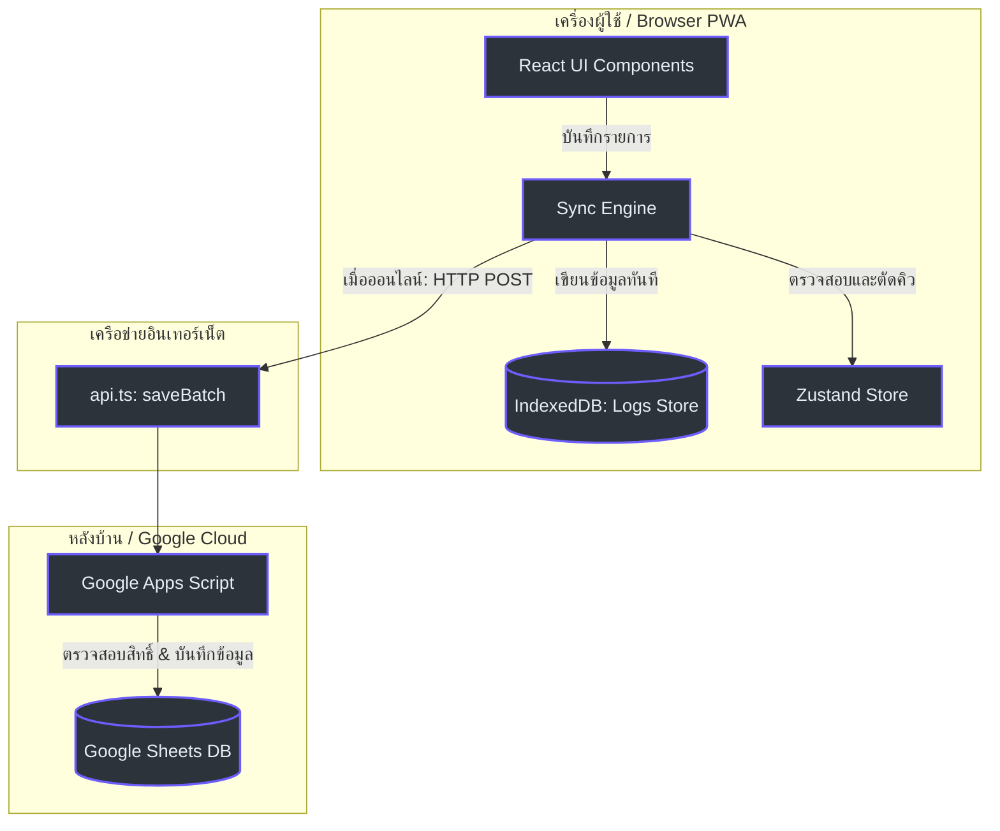

# Admin Handover & Database Maintenance Guide / คู่มือการส่งมอบงานและการดูแลระบบสำหรับผู้ดูแลระบบ

เอกสารฉบับนี้จัดทำขึ้นเพื่อใช้เป็นคู่มือสำหรับผู้ดูแลระบบ (Administrators) ในการบริหารจัดการและบำรุงรักษาระบบ **WUS Track DCG** ให้สามารถทำงานร่วมกับฐานข้อมูล Google Sheets ได้อย่างต่อเนื่อง มีประสิทธิภาพ และปลอดภัยในระยะยาว

---

## 🏛️ System Architecture / สถาปัตยกรรมระบบและกลไกการซิงค์ออฟไลน์

ระบบการเก็บรักษาและซิงค์ข้อมูลทำงานร่วมกันระหว่างพื้นที่เก็บข้อมูล 3 ระดับเพื่อรองรับการใช้งานออฟไลน์ (Offline-First Architecture):



### 1. การไหลของข้อมูลและการซิงค์แบบออฟไลน์ (Data Flow Sequence)

เมื่อพนักงานทำการกดบันทึกข้อมูลขณะออฟไลน์หรือสัญญาณเครือข่ายขัดข้อง:

```mermaid
sequenceDiagram
    autonumber
    actor Staff as พนักงานไปรษณีย์
    participant UI as หน้าจอระบบ (React)
    participant SE as Sync Engine
    participant DB as IndexedDB (Local)
    participant API as GAS Web App API
    participant Sheet as Google Sheets

    Staff->>UI: กรอกข้อมูลงานและกดบันทึก
    UI->>SE: เรียก saveTransaction()
    SE->>DB: บันทึกข้อมูลแบบ Flat และตั้งค่า status = 'pending'
    SE->>UI: แสดงผลสำเร็จทันที (Optimistic UI) และลดภาระรอคอย
    Note over SE, API: เริ่มการทำงานของ Sync Queue (ทำงานเบื้องหลัง)
    SE->>API: ตรวจสอบสัญญาณผ่าน checkConnection()
    alt สัญญาณเชื่อมต่อออฟไลน์ (Offline)
        SE-->>UI: อัปเดตไอคอนเป็นสถานะ "โหมดออฟไลน์ (คิวค้างซิงค์)"
    else สัญญาณเครือข่ายปกติ (Online)
        SE->>DB: อัปเดตสถานะคิวเป็น 'syncing'
        SE->>API: ส่งข้อมูลผ่าน saveBatch()
        API->>Sheet: เพิ่มแถวข้อมูลพร้อมตรวจสอบ UUID เพื่อป้องกันการเซฟซ้ำ
        API-->>SE: ตอบกลับสำเร็จ (status: success)
        SE->>DB: ลบ/อัปเดตสถานะในเครื่องเป็น 'synced'
        SE-->>UI: อัปเดตหน้าจอเป็นสถานะ "เชื่อมต่อออนไลน์" และเคลียร์จำนวนคิวค้าง
    end
    style Staff fill:#2d333b,stroke:#6d5dfc,color:#e6edf3
    style UI fill:#2d333b,stroke:#6d5dfc,color:#e6edf3
    style SE fill:#2d333b,stroke:#6d5dfc,color:#e6edf3
    style DB fill:#2d333b,stroke:#6d5dfc,color:#e6edf3
    style API fill:#2d333b,stroke:#6d5dfc,color:#e6edf3
    style Sheet fill:#2d333b,stroke:#6d5dfc,color:#e6edf3
```

---

## 🛠️ Step-by-Step Environment Setup / ขั้นตอนการติดตั้งสภาพแวดล้อมระบบ

ในการนำระบบหลังบ้านไปใช้งานเป็นเวอร์ชันทดสอบหรือใช้งานจริง ให้ดำเนินงานตามขั้นตอนดังนี้:

### 1. การคัดลอกฐานข้อมูลสเปรดชีต (Spreadsheet Setup)
1. เข้าไปที่สเปรดชีตฐานข้อมูลต้นแบบแล้วทำการคัดลอกไฟล์ (File -> Make a copy)
  2. ตรวจสอบให้มั่นใจว่าภายในมีแท็บข้อมูล (Sheets) ครบ 8 แท็บหลักตามโครงสร้างนี้:
     * `Master_Users`: บันทึกผู้ใช้และสิทธิ์ (`UserID`, `Email`, `FullName`, `Role`, `Status`)
     * `Master_Departments`: บันทึกข้อมูลแผนกและกลุ่มสายส่ง (`DeptID`, `DeptName`, `RouteGroup`, `Building`, `Floor`, `BudgetOwner`)
     * `Master_Services`: บันทึกประเภทบริการไปรษณีย์ภายนอก (`ServiceID`, `ServiceName`, `Description`)
     * `System_Config`: ค่ากำหนดของระบบแบบไดนามิก (`Key`, `Value`, `Description`)
     * `Tx_InternalRun`: เก็บประวัติการเดินรถรับเอกสารภายใน (`TxID`, `Timestamp`, `DeptName`, `Route`, `Round`, `ItemCount`, `Note`, `StaffEmail`)
     * `Tx_InternalSort`: เก็บข้อมูลและปริมาณไปรษณีย์ภัณฑ์ที่คัดแยก (`TxID`, `Timestamp`, `DeptName`, `NormalCount`, `RegisterCount`, `PrivateCount`, `Total`, `Note`, `StaffEmail`)
     * `Tx_ExternalPost`: เก็บประวัติการส่งมอบภายนอกและค่าบริการ (`TxID`, `Timestamp`, `RequestingDept`, `ServiceType`, `Cost`, `ItemCount`, `TrackingNo`, `FundSource`, `StaffEmail`)
     * `Tx_OTPStore`: ตารางลงทะเบียนเซสชันและรหัสผ่านชั่วคราว (OTP)
     * `Feedback_Reports`: เก็บประวัติรายงานปัญหาและข้อเสนอแนะ (`Timestamp`, `StaffEmail`, `FeedbackType`, `Severity`, `Description`)

### 2. การสร้าง Web App ผ่าน Google Apps Script
1. เปิดสเปรดชีตที่คัดลอกขึ้นมา ไปที่เมนู **Extensions -> Apps Script**
2. คัดลอกซอร์สโค้ดจากไฟล์ `backend.gs` (ในระบบต้นแบบ) ไปวางแทนที่ในหน้าต่างแก้ไขโค้ดทั้งหมด
3. ไปที่ **Project Settings (รูปเฟืองด้านซ้าย)** เพิ่มตัวแปรคุณสมบัติสคริปต์ (Script Properties) ดังนี้:
   * `SPREADSHEET_ID`: ใส่ ID ของสเปรดชีตที่กำลังเปิดใช้งานอยู่ (นำมาจาก URL ของชีต เช่น `https://docs.google.com/spreadsheets/d/[ID_ตรงนี้]/edit`)
   * `ALLOW_MOCK_TOKEN`: ตั้งค่าเป็น `true` หากเป็นระบบทดสอบบน localhost เพื่อให้สามารถล็อกอินโดยใช้ Mock Token ได้โดยไม่ต้องรอการส่งอีเมลจริง
4. กดบันทึกโครงการ จากนั้นคลิก **Deploy -> New deployment**
5. เลือกประเภทการ Deploy เป็น **Web app**
   * **Execute as**: เลือกเป็นตัวบัญชีผู้ดูแลระบบ (Me)
   * **Who has access**: เลือกเป็น **Anyone** (เพื่อให้ระบบ Frontend สามารถเรียก API เข้ามาบันทึกข้อมูลได้)
6. กดปุ่ม Deploy จากนั้นคัดลอกค่า **Web app URL** (เช่น `https://script.google.com/macros/s/.../exec`) เก็บไว้

### 3. การกำหนดค่าปลายทางสำหรับ Frontend (Frontend API Routing)
1. เปิดไฟล์ตั้งค่าโครงการ `src/config.ts` ในซอร์สโค้ดของโปรเจกต์ `wus-track`
2. แก้ไขตัวแปร `API_URL` ให้ชี้ไปยังตำแหน่ง Web App URL ใหม่ที่สร้างขึ้น:
   ```typescript
   export const API_URL = "https://script.google.com/macros/s/AKfycbz...ของคุณ/exec";
   ```
3. รันคำสั่งทดสอบคอมไพล์ผ่าน `npm run build` เพื่อยืนยันว่าไม่มีข้อผิดพลาดทางไวยากรณ์

---

## 📂 Key Source Code Tracing / รายการไฟล์และเส้นทางโค้ดควบคุมระบบ

ในการแก้ไขพฤติกรรมในอนาคต ผู้ดูแลระบบสามารถตรวจสอบการทำงานของระบบผ่านไฟล์โค้ดหลักดังนี้:

| วัตถุประสงค์การตรวจสอบ | เส้นทางไฟล์กายภาพ (Physical File Path) | ฟังก์ชันควบคุมสำคัญ / โค้ดจุดที่เกี่ยวข้อง |
|---|---|---|
| **โครงสร้าง IndexedDB Local** | [src/lib/db.ts](file:///D:/%5BDEV%5D%20__WUS_Track_DB/src/lib/db.ts) | ฟังก์ชัน `initDB()` บรรทัดที่ 34-62 กำหนด Schema เวอร์ชันของฐานข้อมูลในเครื่องทั้งหมด |
| **การส่งคำขอกลาง (API REST)** | [src/services/api.ts](file:///D:/%5BDEV%5D%20__WUS_Track_DB/src/services/api.ts) | ฟังก์ชัน `saveBatch()` บรรทัดที่ 34-44 และ `checkConnection()` บรรทัดที่ 80-92 สำหรับยิงเข้า Apps Script |
| **ลูปคิวซิงค์เบื้องหลัง** | [src/services/syncEngine.ts](file:///D:/%5BDEV%5D%20__WUS_Track_DB/src/services/syncEngine.ts) | ฟังก์ชัน `syncPendingLogs()` บรรทัดที่ 12-62 เป็นหัวใจในการดึงคิว ประมวลสถานะ และอัปโหลดไปยังคลาวด์ |
| **สถานะตัวแปรและข้อมูลดิบ** | [src/store/useAppStore.ts](file:///D:/%5BDEV%5D%20__WUS_Track_DB/src/store/useAppStore.ts) | สถานะ `isOnline` และ `syncQueueCount` บรรทัดที่ 37-40 คอยตรวจสอบเพื่อแสดงผลต่อ UI |
| **การดักฟังและตั้งเวลาคิว** | [src/App.tsx](file:///D:/%5BDEV%5D%20__WUS_Track_DB/src/App.tsx) | ฟังก์ชัน `checkNetworkAndSync()` บรรทัดที่ 57-64 คอยตรวจสอบการเปลี่ยนสถานะเน็ต และยิงซิงค์ทุก 30 วินาที |
| **ส่วนจัดแสดงสถานะบนเมนู** | [src/components/layout/MainLayout.tsx](file:///D:/%5BDEV%5D%20__WUS_Track_DB/src/components/layout/MainLayout.tsx) | โครงสร้าง CSS และ Badge แสดงสถานะ Desktop (บรรทัด 148-181) และ Mobile (บรรทัด 271-294) |

---

## 🧹 Database & Sync Troubleshooting / การแก้ไขปัญหาการซิงค์ข้อมูลล้มเหลว

กรณีที่พบปัญหาระบบไม่สามารถเชื่อมต่อ หรือมีข้อมูลค้างคิวในตัวผู้ใช้ไม่สามารถซิงค์ได้:

### 1. การตรวจสอบสถานะในฝั่งเบราว์เซอร์ของผู้ใช้งาน
1. ให้ผู้ใช้งานเปิดเว็บแอปพลิเคชันขึ้นมา จากนั้นกดปุ่ม `F12` เพื่อเปิด DevTools (สำหรับ Chrome/Edge)
2. เลือกแท็บ **Application -> Storage -> IndexedDB**
3. คลิกขยายฐานข้อมูล `wus-track-db` จากนั้นคลิกที่ตาราง `logs`
4. ตรวจสอบคอลัมน์ `syncStatus`:
   * หากคอลัมน์ขึ้นสถานะเป็น `pending` แสดงว่าอยู่ในคิวรอสัญญาณอินเทอร์เน็ตปกติ
   * หากขึ้นสถานะเป็น `syncing` ค้างไว้นานผิดปกติ แสดงว่ามีปัญหาขณะเชื่อมโยง payload ในการบันทึก
5. สามารถดูข้อมูลในฟิลด์ `data` เพื่อตรวจสอบว่าพัสดุใดติดค้างอยู่ในเครื่องเพื่อจดบันทึกทดแทนก่อนได้

### 2. การสั่งซิงค์ข้อมูลบังคับ (Manual Sync)
บนแถบสไตล์ UI ของ Desktop ผู้ใช้สามารถคลิกคำสั่ง **[ ซิงค์ ]** สีม่วงขนาดเล็กในบริเวณสถานะเชื่อมต่อ เพื่อส่งสัญญาณเรียก `syncEngine.syncPendingLogs()` บังคับให้เริ่มพยายามเชื่อมต่อส่งข้อมูลเข้าสเปรดชีตอีกครั้งได้ทันทีโดยไม่ต้องรอให้ครบเวลาตรวจจับ

---

## 🔗 อ้างอิงเอกสารที่เกี่ยวข้อง (References)
* **[สารบัญวิกิ](./index.md)** - กลับไปยังหน้าดัชนีเอกสารหลัก
* **[สถาปัตยกรรมระบบ](./architecture.md)** - รายละเอียด API Contract และ Payload
* **[รายงานความปลอดภัย](./vulnerabilities.md)** - มาตรการป้องกัน Formula Injection และสิทธิ์ระบบล็อกอิน
